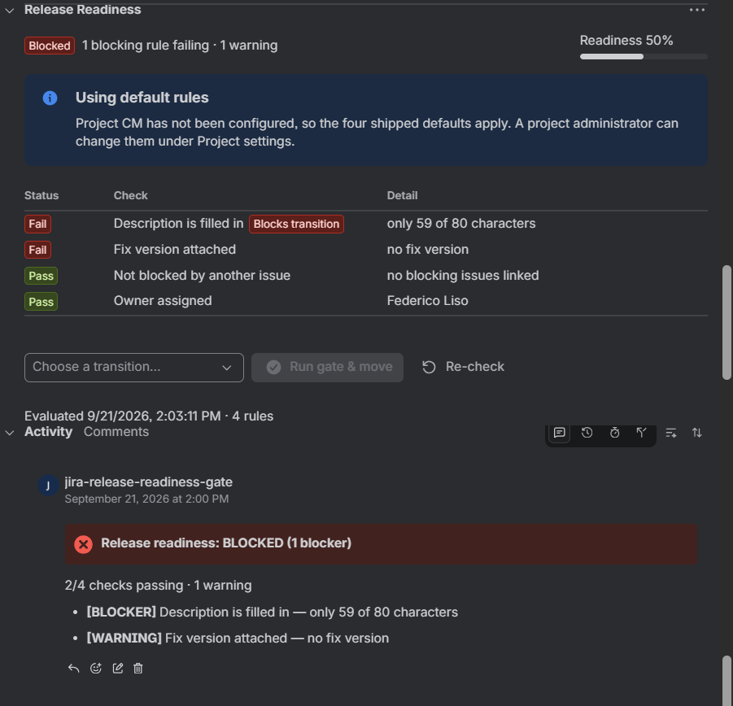
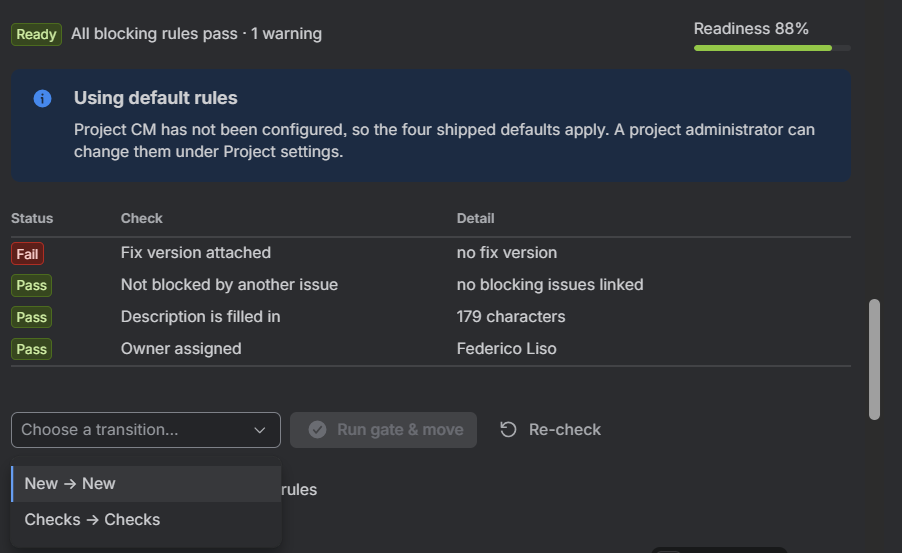
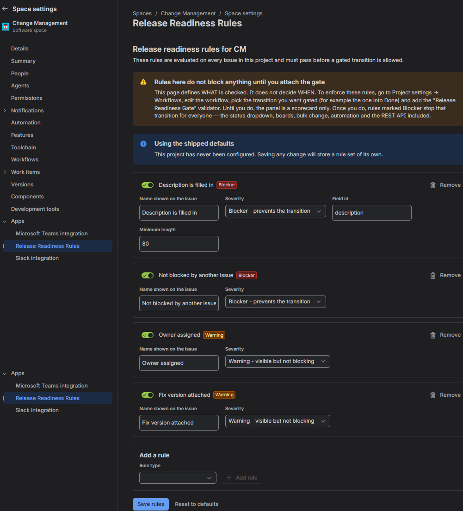
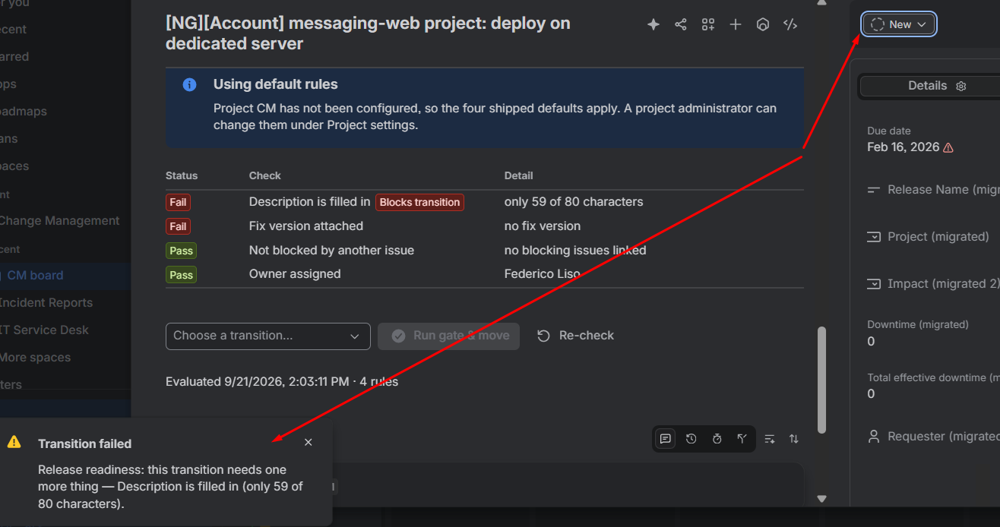
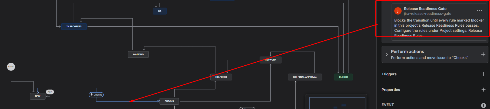

# Release Readiness Gate

**An Atlassian Forge app that turns "did we actually do the pre-release checklist?" from a
conversation into a control Jira enforces.**

It evaluates a configurable rule set against every Jira issue, shows the result as a scorecard on
the issue, and — through a workflow validator an admin attaches to the transitions that matter —
refuses to let work move forward until the blocking rules pass, leaving an audit comment recording
why.

Runs entirely on Atlassian's infrastructure. No servers, no external data egress, no secrets in the
codebase.

> **This repository is a case study, not a distribution.** It documents the design and shows
> representative source. It is not a runnable app and is not intended to be installed.

---

| Blocked | Ready | Rule editor |
| :---: | :---: | :---: |
|  |  |  |
| Each check reports *why* it failed, not just that it did. | Blockers weigh triple, so the score tracks release risk. | Nine rule types, configurable per project by an admin. |

---

## The problem

Every engineering org has a definition of done. Almost none of them can enforce it.

The checklist lives in a Confluence page nobody opens, or in a team norm that survives exactly as
long as the person who cares about it. Work reaches production with no acceptance criteria, no
owner, no release attached, and an unresolved dependency nobody noticed. The failure is discovered
in the retro, which is the most expensive possible place to discover it.

Jira can enforce *structure* — required fields, workflow conditions — but it cannot express
"this is ready to release", because readiness is a composite of a dozen small facts that differ
per team and change over time.

## The approach

Three surfaces, one shared decision engine.

| Surface | Job |
| --- | --- |
| **Issue panel** | Show where this issue stands, and why, in the place people already work |
| **Project settings** | Let a project admin define readiness for *their* team, without a developer |
| **Workflow validator** | Actually stop the transition — everywhere, not just in our UI |

Plus two background jobs that keep the picture honest when nobody is looking: a product trigger
that re-evaluates on change, and a nightly sweep that catches issues which went non-compliant
because time passed or the rules changed.

## The decision that shapes everything else

**All decision logic lives in one pure module that imports nothing from Forge.**

`rules.js` takes plain objects and returns plain objects. It has no network access, no storage, and
no ambient clock — the current time is passed in. Everything around it is a thin adapter that does
I/O and nothing else.

Three things follow:

1. **The panel, the gate and the nightly sweep can never disagree.** They are not three
   implementations of "is this ready"; they are three callers of one function.
2. **The engine is tested in under two seconds** with no Jira instance, no tunnel, and no mocking
   framework. 50 tests, zero mocks.
3. **Adding a rule type is one self-contained entry plus a test.** The resolvers, the UI and the
   storage layer need no changes — the admin UI generates its catalogue from the engine, so a new
   rule type appears in the dropdown the moment it exists.

See [`samples/src/core/rules.js`](samples/src/core/rules.js) for the module itself and
[`samples/src/core/rules.test.js`](samples/src/core/rules.test.js) for what testing it looks like when
nothing needs mocking.

## Enforcement, and why the obvious version is wrong

The first working version gated transitions from a button on the issue panel. It looked complete
and it was worthless: the panel's button is one of six ways to move a Jira issue. The status
dropdown, a card dragged on a board, a bulk change, an Automation rule and the REST API all walked
straight past it.

A gate you can walk around is not a gate.

The real enforcement is a `jira:workflowValidator`, which runs *inside Jira's workflow engine*:

| Route into a transition | Gated |
| --- | :---: |
| Status dropdown on the issue | ✅ |
| Dragging a card on a board | ✅ |
| Bulk change | ✅ |
| Jira Automation | ✅ |
| REST API and other apps | ✅ |
| The app's own panel button | ✅ |

| Enforced at the source | Configured where Jira already keeps it |
| :---: | :---: |
|  |  |
| Moving the issue from **Jira's own status dropdown** — never touching the app's panel — is refused, and the message names the check that failed and what is wrong with it. | The admin attaches the gate to the transitions that matter, in the workflow editor. |

**Which transitions are gated is deliberately not configurable in this app.** An admin attaches the
validator to specific transitions in Jira's own workflow editor. Jira already owns transition
configuration; a second transition picker inside the app would disagree with the workflow sooner or
later. Gate the transition into Done, leave the one into In Progress alone.

The validator also evaluates the issue *as it will be* — including values typed on the transition
screen but not yet saved — so a user can fix the problem and pass in a single action.

## Architecture

```
                     ┌──────────────────────────────────────────┐
   Jira issue view ─▶│ jira:issuePanel            (UI Kit)      │
  Project settings ─▶│ jira:projectSettingsPage   (UI Kit)      │
                     └────────────────┬─────────────────────────┘
                                      │ invoke()
                     ┌────────────────▼─────────────────────────┐
                     │ resolvers/   panel · settings            │ ← authorisation,
                     └────────────────┬─────────────────────────┘   context extraction
                                      │
  jira:workflowValidator ────────────▶│  ← ENFORCEMENT, inside Jira's
  avi:jira:updated:issue ────────────▶│    workflow engine
  scheduledTrigger (daily) ──────────▶│
                     ┌────────────────▼─────────────────────────┐
                     │ core/   rules · normalize · adf ·        │ ← PURE. no I/O.
                     │         transition                       │   100% of the
                     │                                          │   decision logic.
                     └────────────────┬─────────────────────────┘
                     ┌────────────────▼─────────────────────────┐
                     │ services/   jira (REST) · store (KVS)    │ ← the only I/O
                     └────────────────┬─────────────────────────┘
                              ┌───────┴────────┐
                         Jira REST v3      Forge KVS
```

Full detail in [docs/architecture.md](docs/architecture.md).

## What's in this repository

| | |
| --- | --- |
| [docs/how-it-works.md](docs/how-it-works.md) | What the app does, from a user's point of view |
| [docs/architecture.md](docs/architecture.md) | Layering, data flow, module map, storage design |
| [docs/engineering-notes.md](docs/engineering-notes.md) | The judgement calls, the trade-offs, and two bugs worth writing down |
| [samples/](samples/) | Representative source — the rules engine, its tests, the validator, the annotated manifest |
| [CHANGELOG.md](CHANGELOG.md) | Release history, known limitations, roadmap |

## Built with

Atlassian Forge · Forge UI Kit (`@forge/react`) · Jira Cloud REST API v3 · Forge KVS ·
Node.js 24 · Jest

**Forge modules used:** `jira:issuePanel`, `jira:projectSettingsPage`, `jira:workflowValidator`,
`trigger`, `scheduledTrigger`

## Scale

| | |
| --- | --- |
| Application code | ~2,400 lines |
| Tests | 50, across 3 suites, ~580 lines |
| Mocking frameworks | 0 |
| Rule types | 9, extensible in one file |
| OAuth scopes requested | 3 — `read:jira-work`, `write:jira-work`, `storage:app` |
| External network egress | none |

## Licence

MIT — see [LICENSE](LICENSE).
